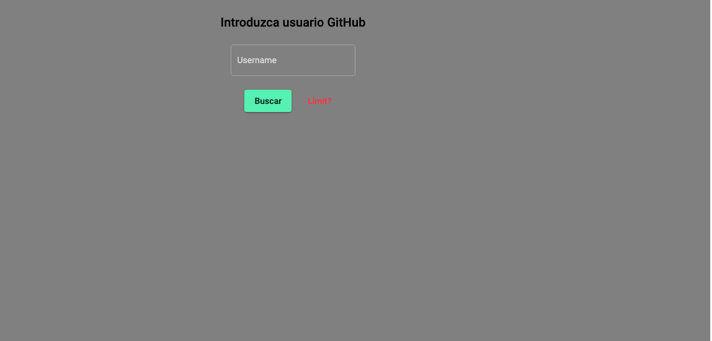
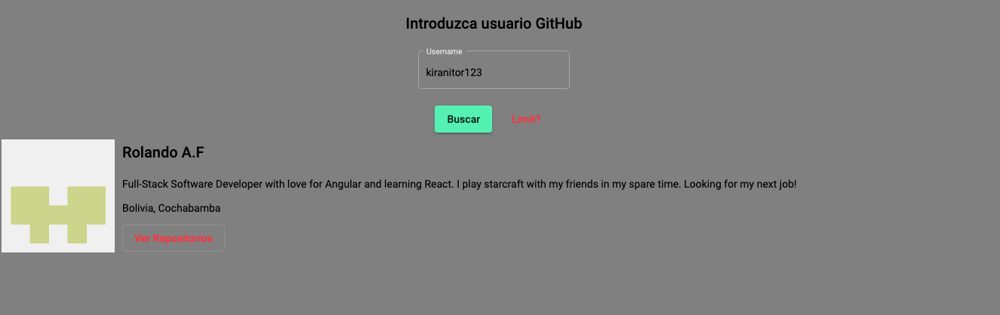
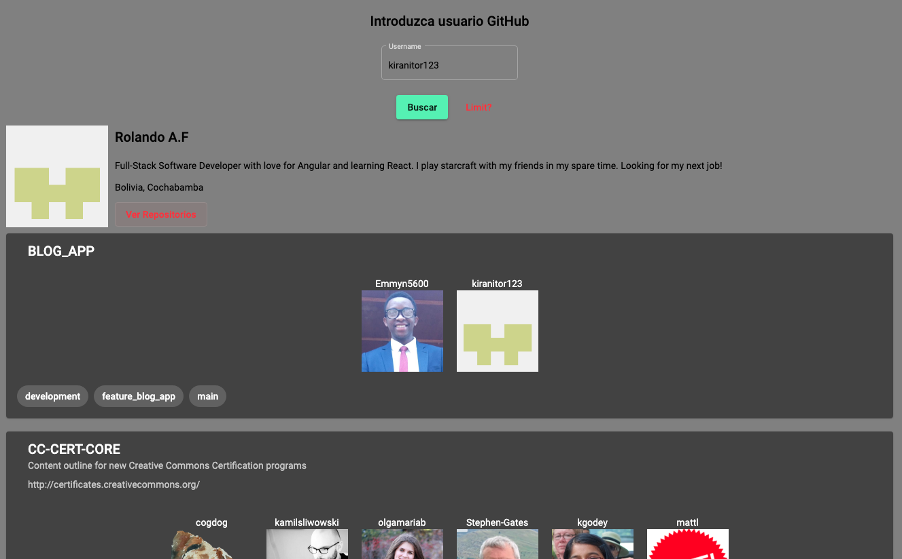
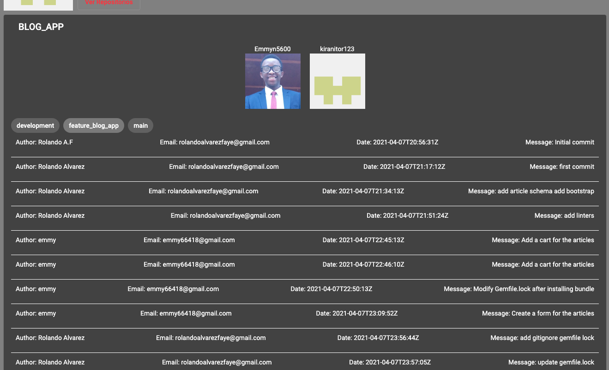

# GitHub Commits Viewer
> This is a web page than you can see all your repos, and commits of github

**What you can do with this project**
- See any github profile
- See all repos of the searcheable profile
- See all branchs and commits.

## Built With

- Angular 12
- Github Rest Api
- VS code

## Getting Started

To get a local copy up and running follow these simple example steps.

- On the project GitHub page, navigate to the main page of the repository [this page](https://github.com/kiranitor123/github-commit-viewer.git).
- Under the repository name, locate and click on a green button named `Code`.
- Copy the project URL as displayed.
- If you're running Windows Operating System, open your command prompt. On Linux, Open your terminal.
- Change the current working directory to the location where you want the cloned directory to be made. Leave as it is if the current location is where you want the project to be.
- Type `git clone`, and then paste the URL you copied in Step 3. 
  `$ git clone https://github.com/kiranitor123/github-commit-viewer.git` <em>Press Enter key</em> 
- Press Enter. Your local copy will be created.

## Setup GitHub Secret Key

- Follow the next tutorial: https://medium.com/frontend-handbooks/a-simple-guide-of-github-rest-api-5f18f0034b4c, and when you get the Authorization token

- Reemplace in the service: github.service.ts, line 15 'Authorization': 'xxxxxxxxxxxxxxxxxxxxxxxxxx'.
- And It will works.

## Author

👤 **Rolando**

- GitHub: [@RolandoAlvarezFaye](https://github.com/kiranitor123)
- Twitter: [@RolandoAlvarezFaye](https://twitter.com/FayeRolando)
- LinkedIn: [Rolando](https://www.linkedin.com/in/rolando-diego-alvarez-faye-b2b34a1a9/)

## 🤝 Contributing

Contributions, issues, and feature requests are welcome!

Feel free to check the [issues page](https://github.com/kiranitor123/github-commit-viewer/issues).

## Show your support

Give a ⭐️ if you like this project!

This project was generated with [Angular CLI](https://github.com/angular/angular-cli) version 12.0.1.

## Development server

Run `ng serve` for a dev server. Navigate to `http://localhost:4200/`. The app will automatically reload if you change any of the source files.

## Build

Run `ng build` to build the project. The build artifacts will be stored in the `dist/` directory.
